# Faces of Aethel

Ten principal-character portraits from *When the Horizon Rose*. Each composition uses posture, environment, clothing, gesture and expression to reveal personality rather than functioning as a neutral costume study.

## Eira Sen — The exacting listener

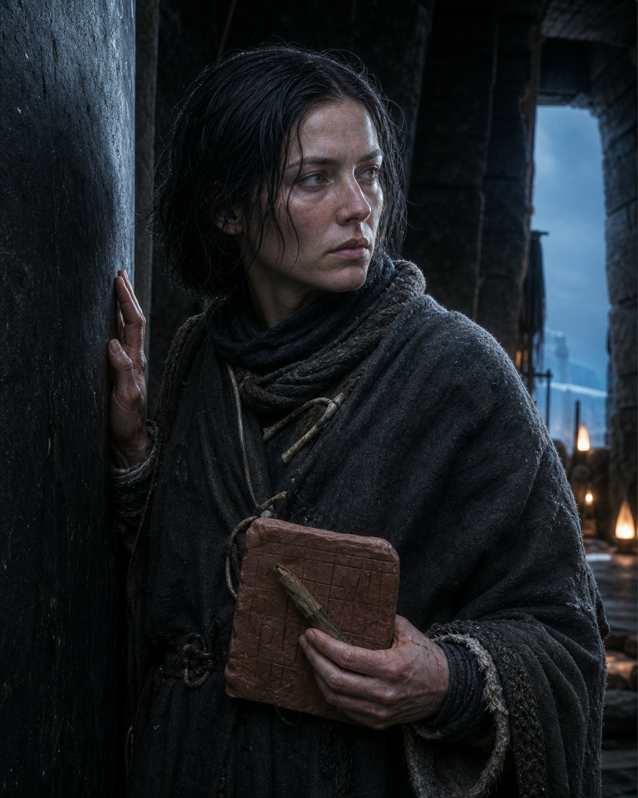

Eira avoids the viewer and touches the listening stone instead. Her guarded posture shows physical caution; the tablet, broken stylus and fixed gaze reveal a mind unwilling to look away from unwelcome evidence.

## Tovan Ash-Hand — The rescuer who needs to be needed

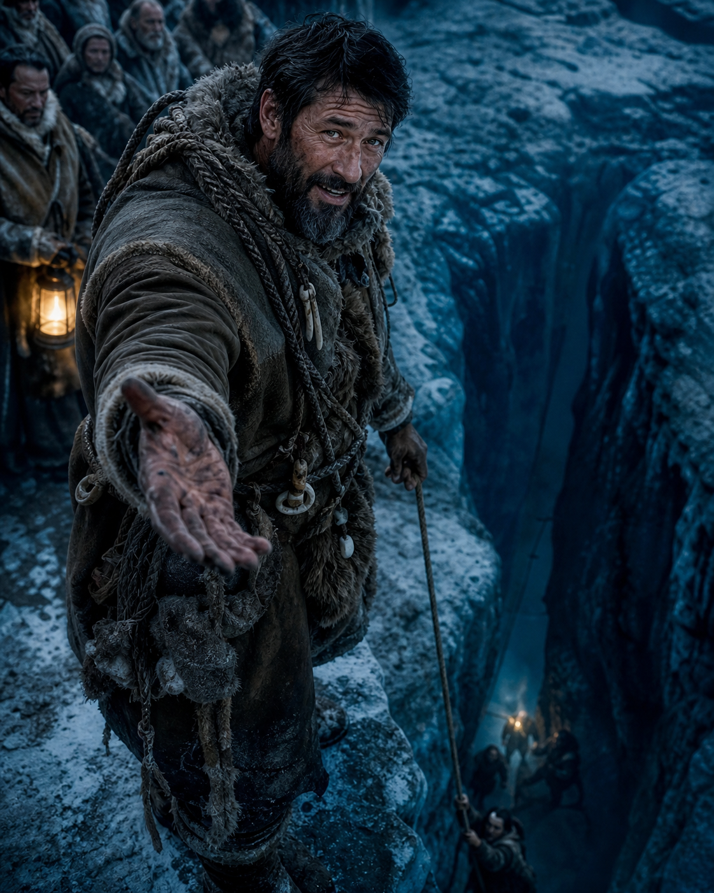

Tovan leans toward danger with his scarred hand extended. His easy expression reassures the people behind him, while his exhausted eyes expose grief and his dependence on impossible acts of rescue.

## Nara Ved — The protector of living things

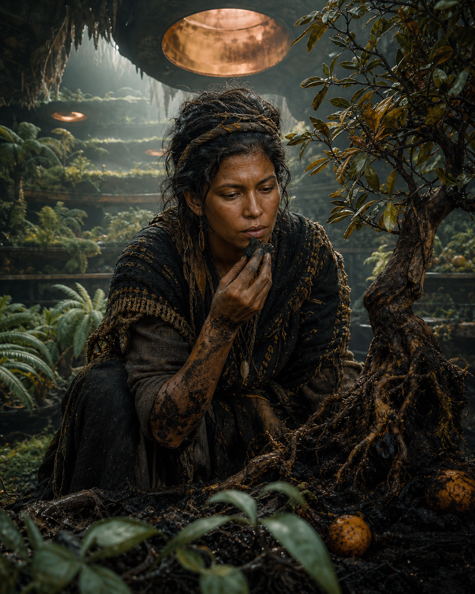

Nara is absorbed in the dying root rather than posing. Mud, damaged citrus and the salt test show sensory intelligence, patience and the ferocity hidden beneath her quiet manner.

## Ilyon Sarr — The beloved, indecisive speaker

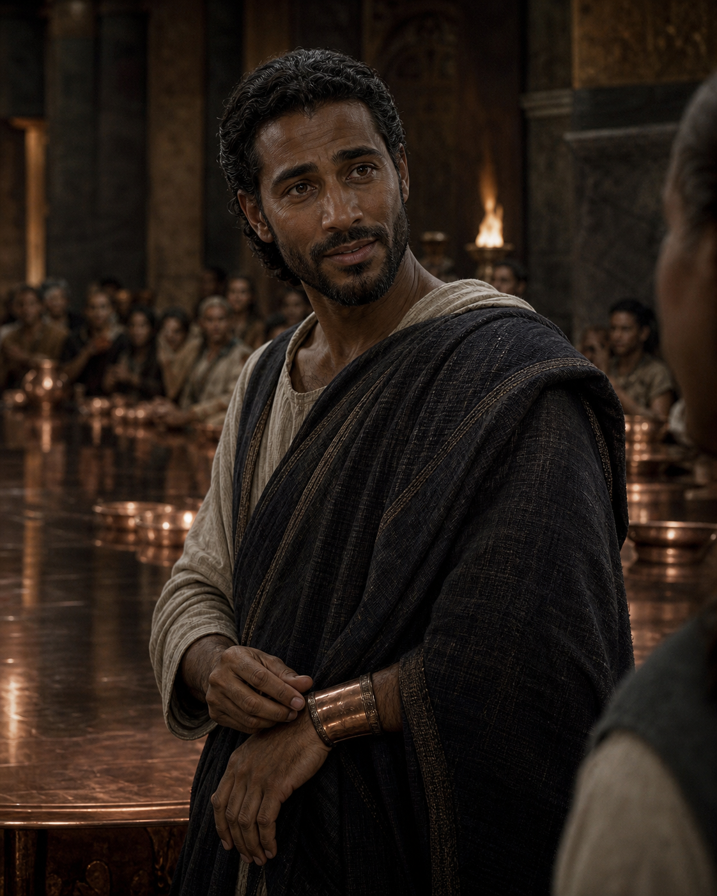

Ilyon turns his entire attention toward one unseen citizen. His warmth is real, but his hand worries the copper band at his wrist: the small gesture betrays trauma, uncertainty and his need to remain loved.

## Seli Nav — The navigator who sees moving shapes

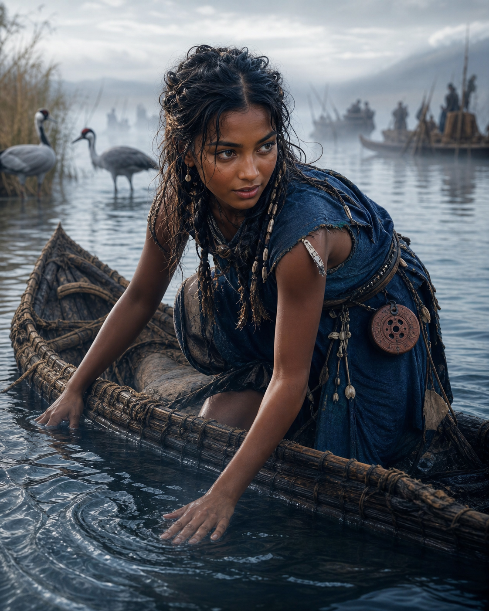

Seli reads the water with her body, ignoring convention and the viewer. Her low, forward posture captures curiosity, impatience and absolute trust in a way of perceiving currents that elders dismiss as childish.

## Maru Drenn — The responsible man making a cruel choice

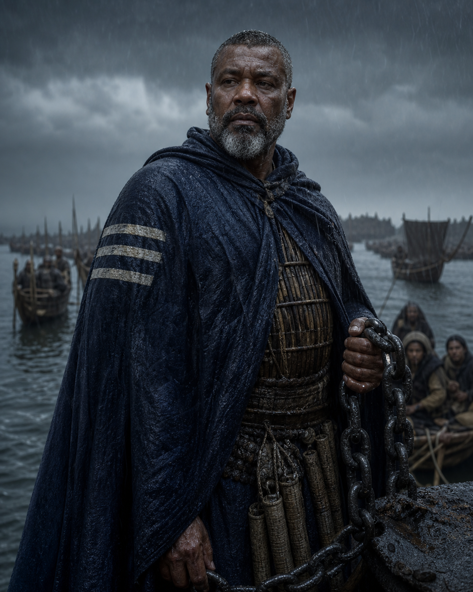

Maru holds the harbour chain while refugees wait behind him. His posture is controlled rather than vicious; duty, old famine trauma and the first private crack of shame coexist in his expression.

## Aven Tal — The mediator afraid of the final choice

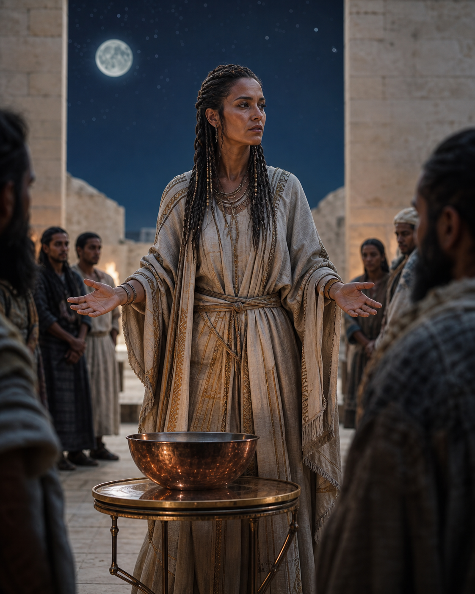

Aven stands exactly between opposing groups with both hands open. Her balance and precise clothing communicate discipline and empathy, while the backward shift of her weight reveals how analysis has become avoidance.

## Tarek Os — The engineer who understands through touch

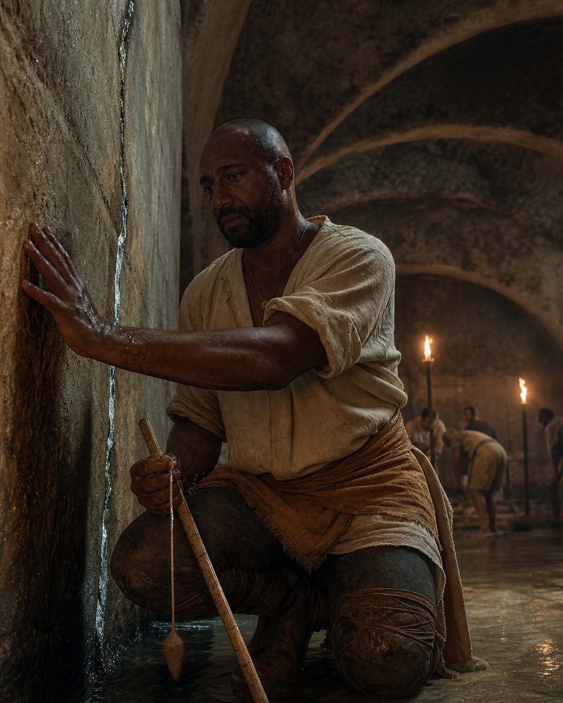

Tarek kneels against the cistern wall instead of dominating the architecture. His attention reveals humility and competence; the heaviness around his eyes shows private grief and dangerous exhaustion.

## Oru the Roadless — The reluctant warning-bearer

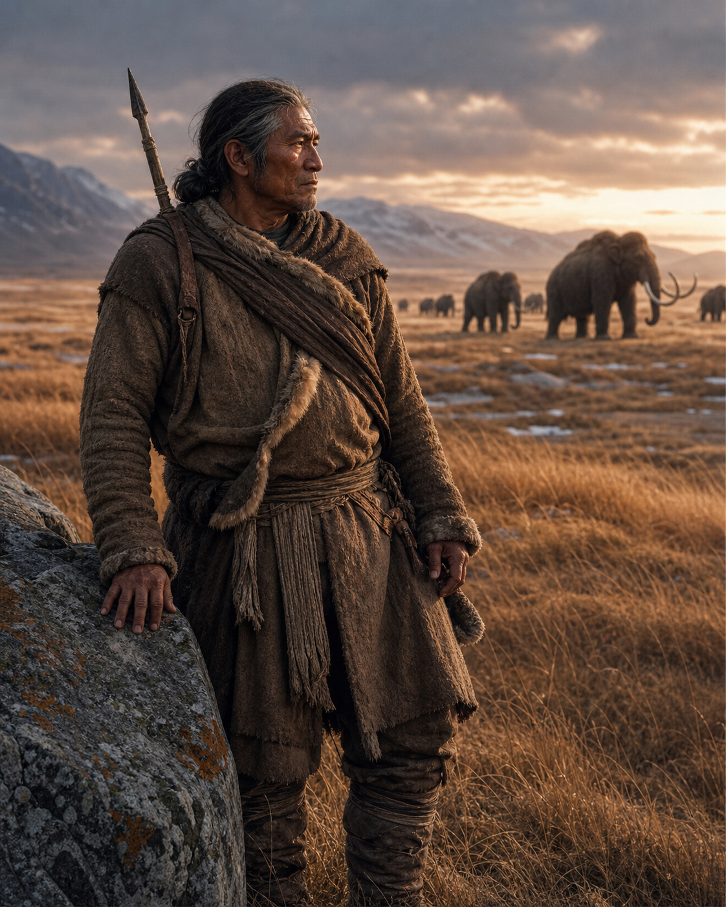

Oru watches the mammoths rather than the cities behind him. The open steppe, practical repairs and patient stance express self-sufficiency, dry humour and knowledge derived from relationship rather than authority.

## Mara-of-No-Hearth — The keeper of contradictory stories

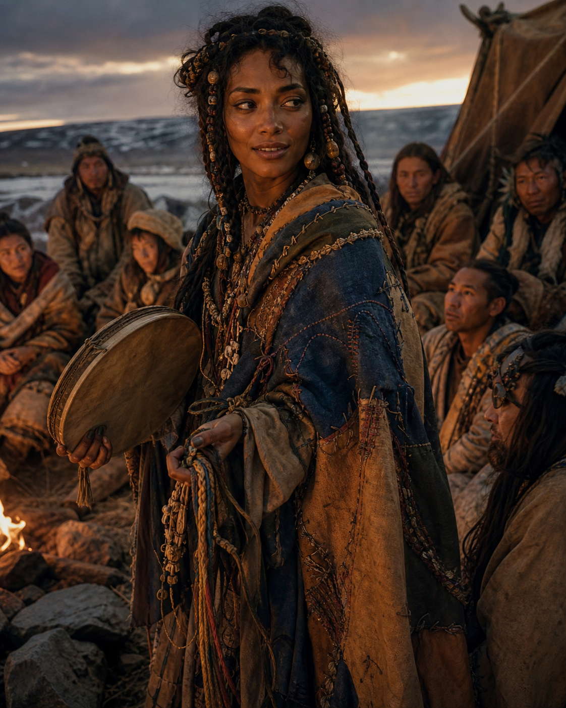

Mara wears fragments of all four cultures and belongs wholly to none. Her half-turned body and almost-smile hold magnetism, compassion, unreliability and the loneliness beneath a lifetime of welcome.

---

## Ensemble plate

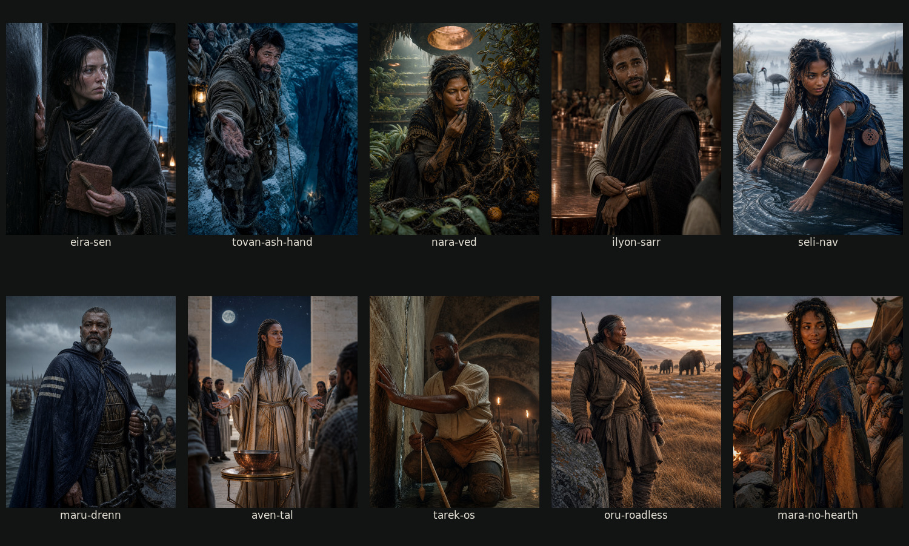

This first collection covers ten principal adults. Kes Luma and Sava Ink-Palm remain next in the principal-character portrait sequence, followed by the major supporting ensemble.
